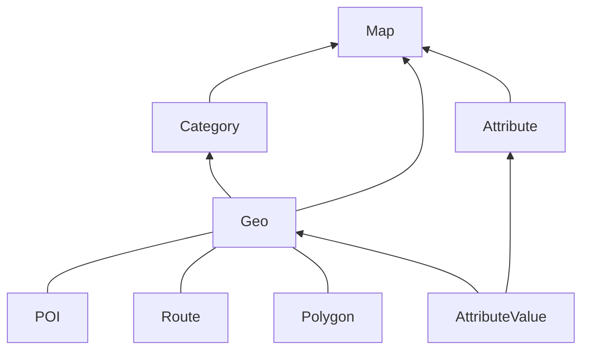

Mapotic documentation
===


This document describes the Mapotic API and how to use it.   
API documentation itself are available on urls:

- https://www.mapotic.com/api/v1/docs/
- https://www.mapotic.com/api/v2/docs/


!!! note

    This documentation does not cover all endpoints. It is focused on the most important ones.

## Basic objects structure



### Map

The most significant object contains main information and settings.

See more in [Map](map.md) documentation.

### Geo

Is parent object provided general structure. With API is not accessible directly.
You can work with it via concrete gis objects as POI, Route, Polygon.

See more in [POI](poi.md), [Route](route.md) and [Polygon](polygon.md) documentation.
Or in generic [Geo](geo.md) documentation.

### Attribute

Keep type of attribute, name of attribute and settings for structured types.

See more in [Attribute](attribute.md) documentation.

```
Attribute
  - map: <map_id>
  - name: E-mail
```

### AttributeValue

Keep value of attribute for concrete geo object.

See more in [Attribute](attribute.md) documentation.

```
AttributeValue
  - geo: <geo_id>
  - attribute: <attribute_id>
  - value: "info@mapotic.com"
```


